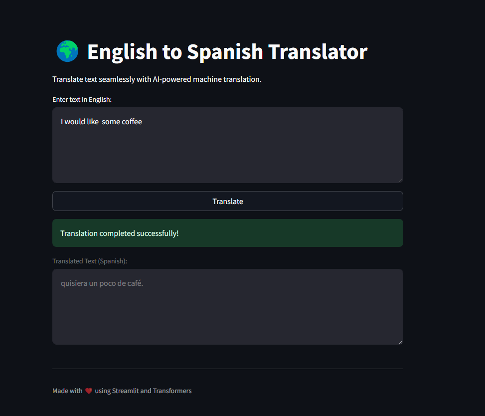

# 🌍 En→Es Neural Translator

## ✨ Introduction

En→Es Neural Translator is a deep learning-powered English-to-Spanish translation tool built on the Transformer architecture. It utilizes the BPE tokenizer with a vocabulary of 10000 tokens, ensuring high-quality, fluent translations. The model is trained on a bilingual corpus and optimized for natural language understanding.

## 📷 Demo

Here's a quick preview of the project in action:



## 📂 File Structure

Here's an overview of the project directory:

```
📂 root
│── 📂 src                      # Source code
|    │── 📂 model               # PyTorch model file
|    │── 📂 train               # Training notebook
|    │── 📜 app.py              # Streamlit application entry point
|    │── 📜 config.py           # Model parameters and configurations
|    │── 📜 load.py             # Utility functions for loading the model
|    │── 📜 model.py            # Translator class definition
|    │── 📜 transformer.py      # Transformer architecture implementation
│── 📜 README.md                # Project documentation
│── 📜 requirements.txt         # Dependencies list
│── 📜 .gitignore               # Ignore unnecessary files
│── 📂 assets
```

## 🚀 Getting Started

Follow these steps to set up and run the project.

### 🔧 Prerequisites

Ensure you have the following installed:

- Python 3.x
- PyTorch
- SentencePiece Tokenizer
- NumPy
- Pandas
- Streamlit

### 📦 Installation

1. **Clone the repository:**

   ```bash
   git clone https://github.com/your-username/your-project.git
   cd your-project
   ```

2. **Create a virtual environment and activate it:**

   ```bash
   python -m venv venv
   source venv/bin/activate  # On Windows use `venv\Scripts\activate`
   ```

3. **Install dependencies:**
   ```bash
   pip install -r requirements.txt
   ```

### ⬇️ Downloading the Model

The translation model is hosted on Hugging Face. You can download it using the `huggingface_hub` library:

```python
from huggingface_hub import hf_hub_download
import torch

REPO_ID = "ridoo14/en-es-transformer"
FILENAME = "model.pth"

model_path = hf_hub_download(repo_id=REPO_ID, filename=FILENAME)
model = torch.load(model_path)
```

Alternatively, you can clone the repository using Git:

```bash
git lfs install
git clone https://huggingface.co/ridoo14/en-es-transformer
```

### ▶️ Running the Application

To launch the translation tool:

```bash
cd src
streamlit run app.py
```

## 🤝 Contributing

Contributions are welcome! If you’d like to improve the model, UI, or documentation, fork the repository and submit a pull request.

## 📜 License

This project is open-source. Feel free to modify and distribute it under the appropriate license.

---

🚀 _Built with ❤️ using Pytorch and Streamlit_
